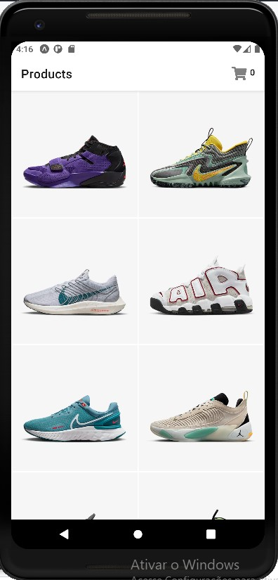
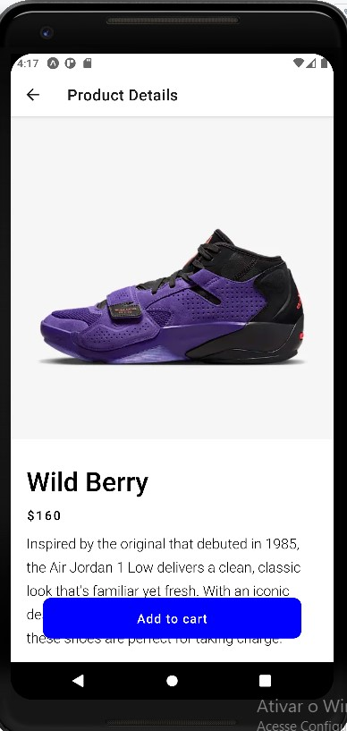
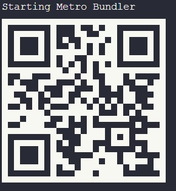

<h1 align="center"> App mini loja Nike</h1>

Projeto desenvolvido com tecnologias Mobile - React Native.

  <a href="#-tecnologias">Tecnologias</a>&nbsp;&nbsp;&nbsp;|&nbsp;&nbsp;&nbsp;
  <a href="#-projeto">Projeto</a>&nbsp;&nbsp;&nbsp;|&nbsp;&nbsp;&nbsp;
  <a href="#-layout">Layout</a>&nbsp;&nbsp;&nbsp;|&nbsp;&nbsp;&nbsp;
  <a href="#memo-licença">Licença</a>

  

 

  

  

  

## 🚀 Tecnologias

Esse projeto foi desenvolvido com as seguintes tecnologias:

- JSX - React Native
- JavaScript
- Expo
- Git e Github

## 💻 Projeto

Loja virtual clone de tênis

## 🔖 Layout

Você pode acessar o projeto através, instalado no seu celular o aplicativo
da expo expoGo e em seguida executando a leitura desse [DESSE QR CODE]:

  

(https://192.168.0.207:19000).
Obs.: para acessar o projeto é necessário ter instalado
o android studio, para utilizar o simulador.

## :memo: Licença

Esse projeto está sob a licença MIT.

---

Feito com ♥ by :wave: Arnóbio Aires
