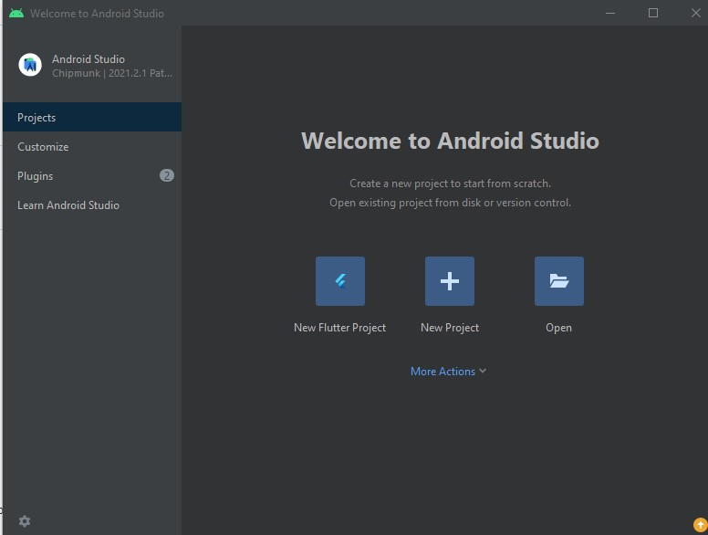

<h1 align="center"> App mini loja Nike</h1>

Projeto desenvolvido com tecnologias Mobile - React Native.

  <a href="#-tecnologias">Tecnologias</a>&nbsp;&nbsp;&nbsp;|&nbsp;&nbsp;&nbsp;
  <a href="#-projeto">Projeto</a>&nbsp;&nbsp;&nbsp;|&nbsp;&nbsp;&nbsp;
  <a href="#-layout">Layout</a>&nbsp;&nbsp;&nbsp;|&nbsp;&nbsp;&nbsp;
  <a href="#memo-licença">Licença</a>

  

 

  

  

  

## 🚀 Tecnologias

Esse projeto foi desenvolvido com as seguintes tecnologias:

- JSX - React Native
- JavaScript
- Expo
- Git e Github

## 💻 Projeto

Loja virtual clone de tênis

## 🔖 Layout

Para acessar o projeto é necessário ter instalado em sua máquina local o android studio.
Após instalação, clique na opçao: More Actions e selecione Virtual Manange Device (o simulador) em seguida execute o seguinte comando
no terminal integrado do VSCode: npx expo start.

  

Quando iniciado você também poderá instalar em seu  smartphone o aplicativo EXPO GO, disponivel na  play store para android, em seguida leia o código abaixo:

  

## :memo: Licença

Esse projeto está sob a licença MIT.

---

Feito com ♥ by :wave: Arnóbio Aires
